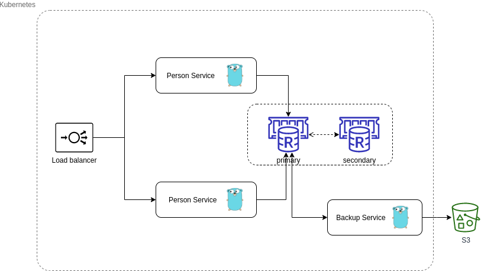

# Microservices assignment in Go
 
Solution to this assignment consists of two services:

- [Person Service](docs/person-service.md)

- [Backup Service](https://github.com/bkuzmic/go-backup-service) - in different repository

## Deployment architecture

Services are deployed to Kubernetes cluster together with Redis cluster (primary-secondary).
Person! Service has 2 instances, while Backup Service only 1.



## Local deployment

### Prerequisites
Install Minikube by following instructions on: https://minikube.sigs.k8s.io/docs/start/

Start Minikube and setup kubectl utility and Helm:
```bash
minikube start
minikube kubectl -- get po -A
# create alias for kubectl
alias kubectl="minikube kubectl --"
# install Helm using installer script
curl -fsSL -o get_helm.sh https://raw.githubusercontent.com/helm/helm/master/scripts/get-helm-3
chmod +x get_helm.sh
./get_helm.sh
# validate Helm installation
helm
```

### Building service

Using _make_ build Person service docker image:
```bash
make docker
```
Then push docker image to hub.docker.com registry. In my case this is the command:

```bash
docker push bkuzmic2/go-person-service:latest
```

### Deployment steps

```bash
# create namespace
kubectl create ns assignment

# create secret
kubectl apply -f deployment/app-secret.yaml -n assignment
kubectl -n assignment describe secret app-secret

# install and run Redis cluster
helm repo add bitnami https://charts.bitnami.com/bitnami
helm install -n assignment rds bitnami/redis --values deployment/redis-values.yaml

# create config map
kubectl apply -n assignment -f deployment/app-configmap.yaml
kubectl describe -n assignment configmap/app-configmap

# install Nginx Ingress
helm repo add ingress-nginx https://kubernetes.github.io/ingress-nginx
helm repo update
helm install -n assignment ingress-nginx ingress-nginx/ingress-nginx

# deploy person service
kubectl apply -n assignment -f deployment/app-deployment.yaml

# deploy Ingress load balancer
kubectl apply -n assignment -f deployment/app-ingress.yaml

# (in another terminal) open tunnel in minikube
minikube tunnel

# Find out external ip address of load balancer
kubectl -n assignment get svc ingress-nginx-controller

# Test load balancer and service are working correctly
curl -H "Host: person-service.test" http://{lb_external_ip}:80/ 

```

Now, go to [Backup Service repository](https://github.com/bkuzmic/go-backup-service)  and deploy it using the provided steps.

## Missing features

- Automated deployment - could be done by using make and above commands in local deployment section 
- Logging - logging levels, reloading of the configuration, critical errors alarming
- Monitoring - performance counters (ie. number of requests), connect with Prometheus

Tasks:

- [x] Write service description and documentation in README
- [x] Sketch deployment diagram in README
- [x] Implement update optimistic method
- [x] Implement update pessimistic method
- [ ] Implement new service in Go that will clean up expired keys
- [x] Write unit tests
- [x] Write integration tests for storage (PARTIALLY)
- [x] Create Make file for building and testing main service
- [ ] Create Make file for building and testing clean up service
- [x] Create deployment files for deployment on Minikube
- [x] Create manual E2E tests in Insomnia to test the service
- [x] Create Dockerfile and local running/testing using docker-compose
- [x] Add basic tests for CRU methods using Insomnia - REST API test tool
- [x] Implement connection to Redis database
- [x] Implement routes for Create, Read and Update (CRU) API calls
- [x] Create initial project on GitHub